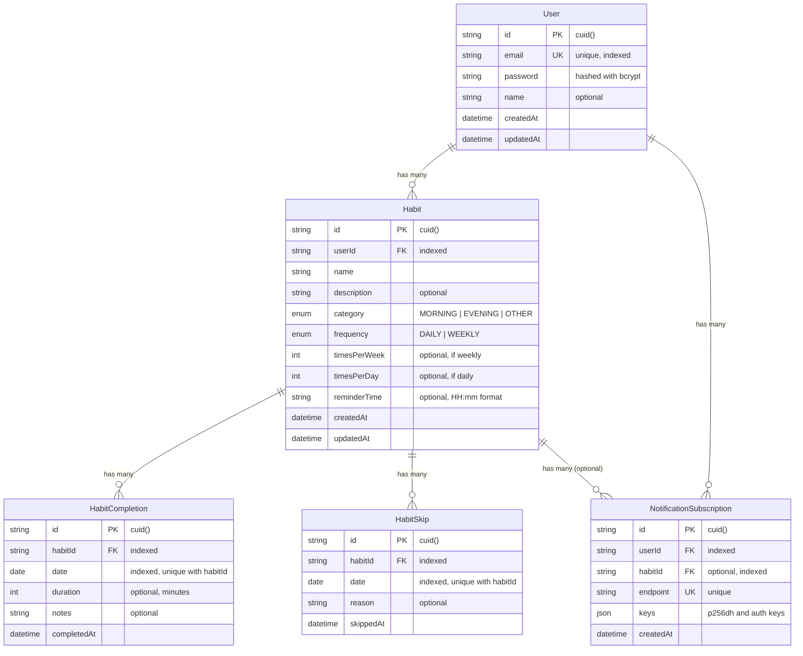
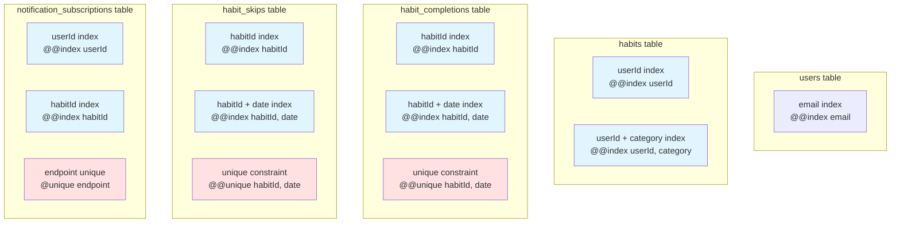

# Habit Tracking App - Detailed Code Design

## Table of Contents
1. [Architecture Overview](#architecture-overview)
2. [Technology Stack & Recommendations](#technology-stack--recommendations)
3. [Database Design](#database-design)
4. [Backend Architecture](#backend-architecture)
5. [Frontend Architecture](#frontend-architecture)
6. [API Design](#api-design)
7. [Type Definitions](#type-definitions)
8. [Component Design](#component-design)
9. [State Management](#state-management)
10. [Service Layer Design](#service-layer-design)
11. [PWA Implementation](#pwa-implementation)
12. [Push Notifications Design](#push-notifications-design)
13. [Security Considerations](#security-considerations)

---

## Architecture Overview

### System Architecture
```
┌─────────────────────────────────────────────────────────┐
│                    Frontend (React PWA)                  │
│  ┌──────────────┐  ┌──────────────┐  ┌──────────────┐  │
│  │   UI Layer   │  │  State Mgmt  │  │   Services   │  │
│  │  Components  │  │   (Zustand)   │  │   (API)      │  │
│  └──────────────┘  └──────────────┘  └──────────────┘  │
│  ┌──────────────────────────────────────────────────┐   │
│  │         Service Worker (PWA + Notifications)      │   │
│  └──────────────────────────────────────────────────┘   │
└─────────────────────────────────────────────────────────┘
                          │
                    HTTPS/REST API
                          │
┌─────────────────────────────────────────────────────────┐
│              Backend (Node.js + Express)                │
│  ┌──────────────┐  ┌──────────────┐  ┌──────────────┐  │
│  │   Routes     │  │ Controllers  │  │   Services   │  │
│  └──────────────┘  └──────────────┘  └──────────────┘  │
│  ┌──────────────┐  ┌──────────────┐  ┌──────────────┐  │
│  │ Middleware   │  │   Prisma     │  │  Web Push    │  │
│  │  (Auth/JWT)  │  │     ORM      │  │   Service    │  │
│  └──────────────┘  └──────────────┘  └──────────────┘  │
└─────────────────────────────────────────────────────────┘
                          │
                    Prisma Client
                          │
┌─────────────────────────────────────────────────────────┐
│              PostgreSQL Database                         │
│  ┌──────────┐  ┌──────────┐  ┌──────────┐  ┌────────┐ │
│  │  Users   │  │  Habits  │  │Completions│ │ Skips  │ │
│  └──────────┘  └──────────┘  └──────────┘  └────────┘ │
│  ┌──────────────────────────────────────────────────┐  │
│  │      NotificationSubscriptions                     │  │
│  └──────────────────────────────────────────────────┘  │
└─────────────────────────────────────────────────────────┘
```

### Data Flow
1. **User Action** → React Component
2. **Component** → Zustand Store Action
3. **Store** → API Service
4. **API Service** → Backend REST API
5. **Backend** → Prisma ORM → PostgreSQL
6. **Response** flows back through the chain

---

## Technology Stack & Recommendations

### Database Recommendation: **PostgreSQL**
**Why PostgreSQL?**
- **Production-ready**: Robust, ACID-compliant, handles concurrent users well
- **Type-safe with Prisma**: Excellent TypeScript integration
- **Free tier options**: Render, Railway, Supabase, Neon
- **Scalable**: Handles growth from single user to thousands
- **Relational data**: Perfect for user-habit-completion relationships
- **JSON support**: Can store notification subscription keys as JSON

**Alternatives:**
- **MySQL**: Good alternative, similar to PostgreSQL
- **MongoDB**: Only if you prefer NoSQL (not recommended for this use case)
- **SQLite**: Only for local development, NOT for production

### CSS Library Recommendation: **Tailwind CSS**
**Why Tailwind CSS?**
- **Mobile-first**: Built-in responsive utilities
- **PWA-friendly**: Small bundle size with purging
- **Fast development**: Utility classes speed up UI building
- **Customizable**: Easy to configure colors, spacing, etc.
- **Great DX**: Excellent IntelliSense support
- **Works with Headless UI**: Accessible component library

**Alternative:** Styled Components or Emotion (CSS-in-JS approach)

### Complete Tech Stack

#### Frontend
- **React 18+** with TypeScript
- **Vite** - Build tool (faster than Create React App)
- **Tailwind CSS** - Styling
- **Headless UI** or **Radix UI** - Accessible components
- **Zustand** - State management (lightweight, simple)
- **React Router v6** - Routing
- **date-fns** - Date manipulation
- **Workbox** - Service worker management
- **Web Push API** - Push notifications

#### Backend
- **Node.js 18+** with TypeScript
- **Express** - Web framework
- **Prisma** - ORM (type-safe database access)
- **PostgreSQL** - Database
- **JWT** - Authentication tokens
- **bcrypt** - Password hashing
- **web-push** - Push notification service
- **zod** - Runtime validation

---

## Database Design

### Prisma Schema

```prisma
// prisma/schema.prisma

generator client {
  provider = "prisma-client-js"
}

datasource db {
  provider = "postgresql"
  url      = env("DATABASE_URL")
}

model User {
  id            String   @id @default(cuid())
  email         String   @unique
  password      String   // hashed with bcrypt
  name          String?
  createdAt     DateTime @default(now())
  updatedAt     DateTime @updatedAt
  
  habits        Habit[]
  subscriptions NotificationSubscription[]
  
  @@index([email])
  @@map("users")
}

model Habit {
  id            String   @id @default(cuid())
  userId        String
  name          String
  description   String?
  category      HabitCategory
  frequency     HabitFrequency
  timesPerWeek  Int?     // if weekly, how many times (1-7)
  timesPerDay   Int?     // if daily, how many times (default: 1)
  timesPerMonth   Int?     // if monthly, how many times (default: 1)
  reminderTime  String?  // HH:mm format (e.g., "07:00" for morning)
  createdAt     DateTime @default(now())
  updatedAt     DateTime @updatedAt
  
  user          User     @relation(fields: [userId], references: [id], onDelete: Cascade)
  completions   HabitCompletion[]
  skips         HabitSkip[]
  subscriptions NotificationSubscription[]
  
  @@index([userId])
  @@index([userId, category])
  @@map("habits")
}

enum HabitCategory {
  MORNING
  EVENING
  OTHER
}

enum HabitFrequency {
  DAILY
  WEEKLY
}

model HabitCompletion {
  id          String   @id @default(cuid())
  habitId     String
  date        DateTime @db.Date
  duration    Int?     // duration in minutes
  notes       String?
  completedAt DateTime @default(now())
  
  habit       Habit    @relation(fields: [habitId], references: [id], onDelete: Cascade)
  
  @@unique([habitId, date])
  @@index([habitId, date])
  @@index([habitId])
  @@map("habit_completions")
}

model HabitSkip {
  id          String   @id @default(cuid())
  habitId     String
  date        DateTime @db.Date
  reason      String?
  skippedAt   DateTime @default(now())
  
  habit       Habit    @relation(fields: [habitId], references: [id], onDelete: Cascade)
  
  @@unique([habitId, date])
  @@index([habitId, date])
  @@index([habitId])
  @@map("habit_skips")
}

model NotificationSubscription {
  id        String   @id @default(cuid())
  userId    String
  habitId   String?  // null for general notifications
  endpoint  String   @unique
  keys      Json     // { p256dh: string, auth: string }
  createdAt DateTime @default(now())
  
  user      User     @relation(fields: [userId], references: [id], onDelete: Cascade)
  habit     Habit?   @relation(fields: [habitId], references: [id], onDelete: Cascade)
  
  @@index([userId])
  @@index([habitId])
  @@map("notification_subscriptions")
}
```

### Database Entity Relationship Diagram (ERD)



### Database Indexes Visualization



### Database Relationships
- **User → Habits**: One-to-Many (user has many habits)
- **Habit → Completions**: One-to-Many (habit has many completion records)
- **Habit → Skips**: One-to-Many (habit has many skip records)
- **User → NotificationSubscriptions**: One-to-Many
- **Habit → NotificationSubscriptions**: One-to-Many (optional, for per-habit notifications)

---

## Backend Architecture

### Directory Structure
```
backend/
├── src/
│   ├── routes/
│   │   ├── index.ts              # Route aggregator
│   │   ├── auth.routes.ts        # Authentication routes
│   │   ├── habits.routes.ts      # Habit CRUD routes
│   │   ├── completions.routes.ts # Completion tracking routes
│   │   ├── skips.routes.ts       # Skip tracking routes
│   │   ├── statistics.routes.ts  # Statistics routes
│   │   └── notifications.routes.ts # Push notification routes
│   │
│   ├── controllers/
│   │   ├── auth.controller.ts
│   │   ├── habit.controller.ts
│   │   ├── completion.controller.ts
│   │   ├── skip.controller.ts
│   │   ├── statistics.controller.ts
│   │   └── notification.controller.ts
│   │
│   ├── services/
│   │   ├── auth.service.ts       # Authentication logic
│   │   ├── habit.service.ts      # Habit business logic
│   │   ├── analytics.service.ts  # Statistics calculations
│   │   └── push-notification.service.ts # Push notification logic
│   │
│   ├── middleware/
│   │   ├── auth.middleware.ts    # JWT verification
│   │   ├── error-handler.middleware.ts
│   │   ├── validation.middleware.ts
│   │   └── rate-limiter.middleware.ts
│   │
│   ├── utils/
│   │   ├── jwt.util.ts
│   │   ├── bcrypt.util.ts
│   │   ├── validation.util.ts
│   │   └── logger.util.ts
│   │
│   ├── types/
│   │   └── index.ts              # Backend-specific types
│   │
│   ├── app.ts                    # Express app setup
│   └── server.ts                 # Server entry point
│
├── prisma/
│   ├── schema.prisma
│   └── migrations/
│
├── .env
├── .env.example
├── package.json
└── tsconfig.json
```

### Key Backend Files

#### `src/app.ts` - Express Application Setup
```typescript
import express from 'express';
import cors from 'cors';
import helmet from 'helmet';
import { errorHandler } from './middleware/error-handler.middleware';
import { routes } from './routes';

const app = express();

// Security middleware
app.use(helmet());
app.use(cors({
  origin: process.env.CORS_ORIGIN || 'http://localhost:5173',
  credentials: true
}));

// Body parsing
app.use(express.json());
app.use(express.urlencoded({ extended: true }));

// Routes
app.use('/api', routes);

// Error handling
app.use(errorHandler);

export default app;
```

#### `src/middleware/auth.middleware.ts` - JWT Authentication
```typescript
import { Request, Response, NextFunction } from 'express';
import jwt from 'jsonwebtoken';
import { prisma } from '../utils/prisma';

export interface AuthRequest extends Request {
  userId?: string;
  user?: {
    id: string;
    email: string;
    name?: string;
  };
}

export const authenticate = async (
  req: AuthRequest,
  res: Response,
  next: NextFunction
): Promise<void> => {
  try {
    const token = req.headers.authorization?.replace('Bearer ', '');
    
    if (!token) {
      res.status(401).json({ error: 'Authentication required' });
      return;
    }

    const decoded = jwt.verify(token, process.env.JWT_SECRET!) as { userId: string };
    
    const user = await prisma.user.findUnique({
      where: { id: decoded.userId },
      select: { id: true, email: true, name: true }
    });

    if (!user) {
      res.status(401).json({ error: 'User not found' });
      return;
    }

    req.userId = user.id;
    req.user = user;
    next();
  } catch (error) {
    res.status(401).json({ error: 'Invalid token' });
  }
};
```

#### `src/controllers/habit.controller.ts` - Habit Controller
```typescript
import { Response } from 'express';
import { AuthRequest } from '../middleware/auth.middleware';
import { habitService } from '../services/habit.service';

export const habitController = {
  // Get all habits for current user
  getAll: async (req: AuthRequest, res: Response): Promise<void> => {
    const habits = await habitService.getUserHabits(req.userId!);
    res.json(habits);
  },

  // Get single habit
  getById: async (req: AuthRequest, res: Response): Promise<void> => {
    const habit = await habitService.getHabitById(req.userId!, req.params.id);
    if (!habit) {
      res.status(404).json({ error: 'Habit not found' });
      return;
    }
    res.json(habit);
  },

  // Create habit
  create: async (req: AuthRequest, res: Response): Promise<void> => {
    const habit = await habitService.createHabit(req.userId!, req.body);
    res.status(201).json(habit);
  },

  // Update habit
  update: async (req: AuthRequest, res: Response): Promise<void> => {
    const habit = await habitService.updateHabit(
      req.userId!,
      req.params.id,
      req.body
    );
    if (!habit) {
      res.status(404).json({ error: 'Habit not found' });
      return;
    }
    res.json(habit);
  },

  // Delete habit
  delete: async (req: AuthRequest, res: Response): Promise<void> => {
    const deleted = await habitService.deleteHabit(req.userId!, req.params.id);
    if (!deleted) {
      res.status(404).json({ error: 'Habit not found' });
      return;
    }
    res.status(204).send();
  }
};
```

#### `src/services/analytics.service.ts` - Statistics Calculations
```typescript
import { prisma } from '../utils/prisma';

export const analyticsService = {
  // Get statistics for a specific habit
  getHabitStatistics: async (userId: string, habitId: string) => {
    const habit = await prisma.habit.findFirst({
      where: { id: habitId, userId },
      include: {
        completions: true,
        skips: true
      }
    });

    if (!habit) return null;

    const totalCompletions = habit.completions.length;
    const totalSkips = habit.skips.length;
    const totalTime = habit.completions.reduce(
      (sum, c) => sum + (c.duration || 0),
      0
    );
    const completionRate = totalCompletions + totalSkips > 0
      ? (totalCompletions / (totalCompletions + totalSkips)) * 100
      : 0;

    // Calculate current streak
    const currentStreak = calculateStreak(habit.completions, habit.skips);
    
    // Calculate longest streak
    const longestStreak = calculateLongestStreak(habit.completions, habit.skips);

    return {
      habitId,
      totalCompletions,
      totalSkips,
      totalTime, // in minutes
      completionRate,
      currentStreak,
      longestStreak
    };
  },

  // Get overall statistics for user
  getUserStatistics: async (userId: string) => {
    const habits = await prisma.habit.findMany({
      where: { userId },
      include: {
        completions: true,
        skips: true
      }
    });

    const totalHabits = habits.length;
    const totalCompletions = habits.reduce(
      (sum, h) => sum + h.completions.length,
      0
    );
    const totalSkips = habits.reduce(
      (sum, h) => sum + h.skips.length,
      0
    );
    const totalTime = habits.reduce(
      (sum, h) => sum + h.completions.reduce(
        (s, c) => s + (c.duration || 0),
        0
      ),
      0
    );

    return {
      totalHabits,
      totalCompletions,
      totalSkips,
      totalTime,
      averageCompletionRate: totalCompletions + totalSkips > 0
        ? (totalCompletions / (totalCompletions + totalSkips)) * 100
        : 0
    };
  }
};

// Helper function to calculate current streak
function calculateStreak(
  completions: Array<{ date: Date }>,
  skips: Array<{ date: Date }>
): number {
  // Implementation: count consecutive days with completion
  // starting from today, going backwards
  // Stop if we hit a skip or a day without completion
  // ... (detailed implementation)
  return 0; // placeholder
}

// Helper function to calculate longest streak
function calculateLongestStreak(
  completions: Array<{ date: Date }>,
  skips: Array<{ date: Date }>
): number {
  // Implementation: find the longest sequence of consecutive completions
  // ... (detailed implementation)
  return 0; // placeholder
}
```

---

## Frontend Architecture

### Directory Structure
```
frontend/
├── src/
│   ├── components/
│   │   ├── auth/
│   │   │   ├── LoginForm.tsx
│   │   │   ├── RegisterForm.tsx
│   │   │   └── ProtectedRoute.tsx
│   │   │
│   │   ├── habits/
│   │   │   ├── HabitList.tsx
│   │   │   ├── HabitCard.tsx
│   │   │   ├── HabitForm.tsx
│   │   │   ├── HabitCategoryFilter.tsx
│   │   │   └── HabitDetail.tsx
│   │   │
│   │   ├── calendar/
│   │   │   ├── CalendarView.tsx
│   │   │   ├── HabitCalendar.tsx
│   │   │   └── CalendarDay.tsx
│   │   │
│   │   ├── statistics/
│   │   │   ├── StatisticsPanel.tsx
│   │   │   ├── StatisticsCard.tsx
│   │   │   └── StatisticsChart.tsx
│   │   │
│   │   ├── notifications/
│   │   │   └── NotificationSettings.tsx
│   │   │
│   │   └── common/
│   │       ├── Button.tsx
│   │       ├── Input.tsx
│   │       ├── Modal.tsx
│   │       └── LoadingSpinner.tsx
│   │
│   ├── pages/
│   │   ├── LoginPage.tsx
│   │   ├── RegisterPage.tsx
│   │   ├── DashboardPage.tsx
│   │   ├── HabitDetailPage.tsx
│   │   └── SettingsPage.tsx
│   │
│   ├── hooks/
│   │   ├── useAuth.ts
│   │   ├── useHabits.ts
│   │   ├── useNotifications.ts
│   │   └── useCalendar.ts
│   │
│   ├── store/
│   │   ├── authStore.ts
│   │   └── habitStore.ts
│   │
│   ├── services/
│   │   ├── api.ts              # Axios instance with interceptors
│   │   ├── authService.ts
│   │   ├── habitService.ts
│   │   ├── completionService.ts
│   │   ├── skipService.ts
│   │   ├── statisticsService.ts
│   │   └── pushNotificationService.ts
│   │
│   ├── utils/
│   │   ├── dateUtils.ts
│   │   ├── calculations.ts
│   │   └── validation.ts
│   │
│   ├── types/
│   │   └── index.ts            # Shared TypeScript types
│   │
│   ├── App.tsx
│   ├── main.tsx
│   └── vite-env.d.ts
│
├── public/
│   ├── manifest.json
│   ├── sw.js                 # Service worker
│   └── icons/                # PWA icons (192x192, 512x512, etc.)
│
├── package.json
├── vite.config.ts
├── tailwind.config.js
└── tsconfig.json
```

### Key Frontend Files

#### `src/types/index.ts` - Type Definitions
```typescript
export type HabitCategory = 'MORNING' | 'EVENING' | 'OTHER';
export type HabitFrequency = 'DAILY' | 'WEEKLY';

export interface User {
  id: string;
  email: string;
  name?: string;
}

export interface Habit {
  id: string;
  userId: string;
  name: string;
  description?: string;
  category: HabitCategory;
  frequency: HabitFrequency;
  timesPerWeek?: number;
  timesPerDay?: number;
  reminderTime?: string; // HH:mm format
  createdAt: string;
  updatedAt: string;
}

export interface HabitCompletion {
  id: string;
  habitId: string;
  date: string; // ISO date string
  duration?: number; // minutes
  notes?: string;
  completedAt: string;
}

export interface HabitSkip {
  id: string;
  habitId: string;
  date: string; // ISO date string
  reason?: string;
  skippedAt: string;
}

export interface HabitStatistics {
  habitId: string;
  totalCompletions: number;
  totalSkips: number;
  totalTime: number; // minutes
  completionRate: number; // percentage
  currentStreak: number; // days
  longestStreak: number; // days
}

export interface CreateHabitDto {
  name: string;
  description?: string;
  category: HabitCategory;
  frequency: HabitFrequency;
  timesPerWeek?: number;
  timesPerDay?: number;
  reminderTime?: string;
}

export interface UpdateHabitDto extends Partial<CreateHabitDto> {}
```

#### `src/store/habitStore.ts` - Zustand Store
```typescript
import { create } from 'zustand';
import { Habit, HabitCompletion, HabitSkip, HabitStatistics } from '../types';
import { habitService } from '../services/habitService';

interface HabitState {
  habits: Habit[];
  selectedHabit: Habit | null;
  completions: Record<string, HabitCompletion[]>; // habitId -> completions
  skips: Record<string, HabitSkip[]>; // habitId -> skips
  statistics: Record<string, HabitStatistics>; // habitId -> statistics
  loading: boolean;
  error: string | null;
  
  // Actions
  fetchHabits: () => Promise<void>;
  fetchHabitById: (id: string) => Promise<void>;
  createHabit: (data: CreateHabitDto) => Promise<void>;
  updateHabit: (id: string, data: UpdateHabitDto) => Promise<void>;
  deleteHabit: (id: string) => Promise<void>;
  fetchCompletions: (habitId: string) => Promise<void>;
  markComplete: (habitId: string, date: string, duration?: number) => Promise<void>;
  markSkipped: (habitId: string, date: string, reason?: string) => Promise<void>;
  fetchStatistics: (habitId: string) => Promise<void>;
  filterByCategory: (category: HabitCategory | null) => Habit[];
}

export const useHabitStore = create<HabitState>((set, get) => ({
  habits: [],
  selectedHabit: null,
  completions: {},
  skips: {},
  statistics: {},
  loading: false,
  error: null,

  fetchHabits: async () => {
    set({ loading: true, error: null });
    try {
      const habits = await habitService.getAll();
      set({ habits, loading: false });
    } catch (error) {
      set({ error: (error as Error).message, loading: false });
    }
  },

  createHabit: async (data) => {
    set({ loading: true, error: null });
    try {
      const habit = await habitService.create(data);
      set((state) => ({
        habits: [...state.habits, habit],
        loading: false
      }));
    } catch (error) {
      set({ error: (error as Error).message, loading: false });
    }
  },

  // ... other actions
}));
```

#### `src/components/habits/HabitForm.tsx` - Habit Form Component
```typescript
import { useState, FormEvent } from 'react';
import { HabitCategory, HabitFrequency, CreateHabitDto } from '../../types';
import { useHabitStore } from '../../store/habitStore';

interface HabitFormProps {
  habitId?: string; // if provided, edit mode
  onClose: () => void;
}

export const HabitForm: React.FC<HabitFormProps> = ({ habitId, onClose }) => {
  const { createHabit, updateHabit, habits } = useHabitStore();
  const habit = habitId ? habits.find(h => h.id === habitId) : null;

  const [formData, setFormData] = useState<CreateHabitDto>({
    name: habit?.name || '',
    description: habit?.description || '',
    category: habit?.category || 'MORNING',
    frequency: habit?.frequency || 'DAILY',
    timesPerWeek: habit?.timesPerWeek,
    timesPerDay: habit?.timesPerDay || 1,
    reminderTime: habit?.reminderTime
  });

  const handleSubmit = async (e: FormEvent) => {
    e.preventDefault();
    try {
      if (habitId) {
        await updateHabit(habitId, formData);
      } else {
        await createHabit(formData);
      }
      onClose();
    } catch (error) {
      console.error('Error saving habit:', error);
    }
  };

  return (
    <form onSubmit={handleSubmit} className="space-y-4">
      <div>
        <label htmlFor="name">Habit Name</label>
        <input
          id="name"
          type="text"
          value={formData.name}
          onChange={(e) => setFormData({ ...formData, name: e.target.value })}
          required
        />
      </div>

      <div>
        <label htmlFor="category">Category</label>
        <select
          id="category"
          value={formData.category}
          onChange={(e) => setFormData({ ...formData, category: e.target.value as HabitCategory })}
        >
          <option value="MORNING">Morning</option>
          <option value="EVENING">Evening</option>
          <option value="OTHER">Other</option>
        </select>
      </div>

      <div>
        <label htmlFor="frequency">Frequency</label>
        <select
          id="frequency"
          value={formData.frequency}
          onChange={(e) => setFormData({ ...formData, frequency: e.target.value as HabitFrequency })}
        >
          <option value="DAILY">Daily</option>
          <option value="WEEKLY">Weekly</option>
        </select>
      </div>

      {formData.frequency === 'WEEKLY' && (
        <div>
          <label htmlFor="timesPerWeek">Times per Week (1-7)</label>
          <input
            id="timesPerWeek"
            type="number"
            min="1"
            max="7"
            value={formData.timesPerWeek || ''}
            onChange={(e) => setFormData({ ...formData, timesPerWeek: parseInt(e.target.value) })}
          />
        </div>
      )}

      {formData.frequency === 'DAILY' && (
        <div>
          <label htmlFor="timesPerDay">Times per Day</label>
          <input
            id="timesPerDay"
            type="number"
            min="1"
            value={formData.timesPerDay || 1}
            onChange={(e) => setFormData({ ...formData, timesPerDay: parseInt(e.target.value) })}
          />
        </div>
      )}

      <div>
        <label htmlFor="reminderTime">Reminder Time (HH:mm)</label>
        <input
          id="reminderTime"
          type="time"
          value={formData.reminderTime || ''}
          onChange={(e) => setFormData({ ...formData, reminderTime: e.target.value })}
        />
      </div>

      <button type="submit">{habitId ? 'Update' : 'Create'} Habit</button>
      <button type="button" onClick={onClose}>Cancel</button>
    </form>
  );
};
```

#### `src/components/calendar/HabitCalendar.tsx` - Calendar Component
```typescript
import { useState } from 'react';
import { format, startOfMonth, endOfMonth, eachDayOfInterval, isSameDay } from 'date-fns';
import { Habit, HabitCompletion, HabitSkip } from '../../types';
import { useHabitStore } from '../../store/habitStore';

interface HabitCalendarProps {
  habit: Habit;
}

export const HabitCalendar: React.FC<HabitCalendarProps> = ({ habit }) => {
  const { completions, skips, markComplete, markSkipped } = useHabitStore();
  const [currentMonth, setCurrentMonth] = useState(new Date());

  const habitCompletions = completions[habit.id] || [];
  const habitSkips = skips[habit.id] || [];

  const monthStart = startOfMonth(currentMonth);
  const monthEnd = endOfMonth(currentMonth);
  const days = eachDayOfInterval({ start: monthStart, end: monthEnd });

  const getDayStatus = (date: Date): 'completed' | 'skipped' | 'pending' => {
    const dateStr = format(date, 'yyyy-MM-dd');
    if (habitCompletions.some(c => isSameDay(new Date(c.date), date))) {
      return 'completed';
    }
    if (habitSkips.some(s => isSameDay(new Date(s.date), date))) {
      return 'skipped';
    }
    return 'pending';
  };

  const handleDayClick = async (date: Date) => {
    const dateStr = format(date, 'yyyy-MM-dd');
    const status = getDayStatus(date);
    
    if (status === 'completed') {
      // Could remove completion or mark as skipped
      await markSkipped(habit.id, dateStr);
    } else if (status === 'skipped') {
      // Mark as completed
      await markComplete(habit.id, dateStr);
    } else {
      // Mark as completed
      await markComplete(habit.id, dateStr);
    }
  };

  return (
    <div className="calendar">
      <div className="calendar-header">
        <button onClick={() => setCurrentMonth(/* previous month */)}>←</button>
        <h2>{format(currentMonth, 'MMMM yyyy')}</h2>
        <button onClick={() => setCurrentMonth(/* next month */)}>→</button>
      </div>
      
      <div className="calendar-grid">
        {days.map(day => {
          const status = getDayStatus(day);
          return (
            <button
              key={day.toISOString()}
              onClick={() => handleDayClick(day)}
              className={`calendar-day ${status}`}
            >
              {format(day, 'd')}
            </button>
          );
        })}
      </div>
    </div>
  );
};
```

---

## API Design

### Authentication Endpoints

#### `POST /api/auth/register`
**Request:**
```json
{
  "email": "user@example.com",
  "password": "securepassword",
  "name": "John Doe"
}
```

**Response:**
```json
{
  "user": {
    "id": "clx...",
    "email": "user@example.com",
    "name": "John Doe"
  },
  "token": "eyJhbGciOiJIUzI1NiIsInR5cCI6IkpXVCJ9..."
}
```

#### `POST /api/auth/login`
**Request:**
```json
{
  "email": "user@example.com",
  "password": "securepassword"
}
```

**Response:** Same as register

#### `GET /api/auth/me`
**Headers:** `Authorization: Bearer <token>`

**Response:**
```json
{
  "id": "clx...",
  "email": "user@example.com",
  "name": "John Doe"
}
```

### Habit Endpoints

#### `GET /api/habits`
**Headers:** `Authorization: Bearer <token>`

**Response:**
```json
[
  {
    "id": "clx...",
    "name": "Morning Meditation",
    "category": "MORNING",
    "frequency": "DAILY",
    "timesPerDay": 1,
    "reminderTime": "07:00",
    "createdAt": "2024-01-01T00:00:00Z"
  }
]
```

#### `POST /api/habits`
**Headers:** `Authorization: Bearer <token>`

**Request:**
```json
{
  "name": "Morning Meditation",
  "description": "10 minutes of meditation",
  "category": "MORNING",
  "frequency": "DAILY",
  "timesPerDay": 1,
  "reminderTime": "07:00"
}
```

**Response:** Created habit object

#### `PUT /api/habits/:id`
**Headers:** `Authorization: Bearer <token>`

**Request:** Same as POST (all fields optional)

**Response:** Updated habit object

#### `DELETE /api/habits/:id`
**Headers:** `Authorization: Bearer <token>`

**Response:** 204 No Content

### Completion Endpoints

#### `POST /api/habits/:habitId/completions`
**Headers:** `Authorization: Bearer <token>`

**Request:**
```json
{
  "date": "2024-01-15",
  "duration": 10,
  "notes": "Felt great today"
}
```

**Response:**
```json
{
  "id": "clx...",
  "habitId": "clx...",
  "date": "2024-01-15",
  "duration": 10,
  "notes": "Felt great today",
  "completedAt": "2024-01-15T08:00:00Z"
}
```

#### `GET /api/habits/:habitId/completions?startDate=2024-01-01&endDate=2024-01-31`
**Response:** Array of completion objects

#### `DELETE /api/completions/:id`
**Response:** 204 No Content

### Skip Endpoints

#### `POST /api/habits/:habitId/skips`
**Request:**
```json
{
  "date": "2024-01-15",
  "reason": "Too tired"
}
```

**Response:** Skip object

### Statistics Endpoints

#### `GET /api/habits/:habitId/statistics`
**Response:**
```json
{
  "habitId": "clx...",
  "totalCompletions": 45,
  "totalSkips": 5,
  "totalTime": 450,
  "completionRate": 90,
  "currentStreak": 7,
  "longestStreak": 14
}
```

#### `GET /api/statistics`
**Response:**
```json
{
  "totalHabits": 5,
  "totalCompletions": 200,
  "totalSkips": 20,
  "totalTime": 2000,
  "averageCompletionRate": 90.9
}
```

### Notification Endpoints

#### `GET /api/notifications/vapid-key`
**Response:**
```json
{
  "publicKey": "BEl62iUYgUivxIkv69yViEuiBIa40HI..."
}
```

#### `POST /api/notifications/subscribe`
**Request:**
```json
{
  "subscription": {
    "endpoint": "https://fcm.googleapis.com/...",
    "keys": {
      "p256dh": "...",
      "auth": "..."
    }
  },
  "habitId": "clx..." // optional, for per-habit notifications
}
```

**Response:** 201 Created

---

## State Management

### Zustand Stores

#### Auth Store
```typescript
interface AuthState {
  user: User | null;
  token: string | null;
  isAuthenticated: boolean;
  login: (email: string, password: string) => Promise<void>;
  register: (email: string, password: string, name?: string) => Promise<void>;
  logout: () => void;
  checkAuth: () => Promise<void>;
}
```

#### Habit Store
```typescript
interface HabitState {
  habits: Habit[];
  selectedHabit: Habit | null;
  completions: Record<string, HabitCompletion[]>;
  skips: Record<string, HabitSkip[]>;
  statistics: Record<string, HabitStatistics>;
  // ... actions
}
```

---

## PWA Implementation

### `public/manifest.json`
```json
{
  "name": "Habits Tracker",
  "short_name": "Habits",
  "description": "Track your daily habits",
  "start_url": "/",
  "display": "standalone",
  "background_color": "#ffffff",
  "theme_color": "#3b82f6",
  "orientation": "portrait",
  "icons": [
    {
      "src": "/icons/icon-192x192.png",
      "sizes": "192x192",
      "type": "image/png",
      "purpose": "any maskable"
    },
    {
      "src": "/icons/icon-512x512.png",
      "sizes": "512x512",
      "type": "image/png",
      "purpose": "any maskable"
    }
  ]
}
```

### Service Worker (`public/sw.js`)
```javascript
// Service worker for offline support and push notifications
self.addEventListener('install', (event) => {
  event.waitUntil(
    caches.open('habits-v1').then((cache) => {
      return cache.addAll([
        '/',
        '/index.html',
        '/static/css/main.css',
        '/static/js/main.js'
      ]);
    })
  );
});

self.addEventListener('fetch', (event) => {
  event.respondWith(
    caches.match(event.request).then((response) => {
      return response || fetch(event.request);
    })
  );
});

// Push notification handler
self.addEventListener('push', (event) => {
  const data = event.data.json();
  const options = {
    body: data.body,
    icon: '/icons/icon-192x192.png',
    badge: '/icons/icon-192x192.png',
    vibrate: [200, 100, 200],
    data: data.habitId
  };
  
  event.waitUntil(
    self.registration.showNotification(data.title, options)
  );
});

// Notification click handler
self.addEventListener('notificationclick', (event) => {
  event.notification.close();
  event.waitUntil(
    clients.openWindow('/habits/' + event.notification.data)
  );
});
```

---

## Push Notifications Design

### Notification Flow
1. **User grants permission** → Browser shows permission dialog
2. **Subscribe** → Frontend calls `PushManager.subscribe()` with VAPID key
3. **Send subscription to backend** → POST `/api/notifications/subscribe`
4. **Backend stores subscription** → Save endpoint and keys to database
5. **Schedule notifications** → Backend cron job checks habits and sends notifications
6. **Service worker receives push** → Shows notification to user
7. **User clicks notification** → Opens app to specific habit

### Notification Scheduling Service
```typescript
// Backend: src/services/push-notification.service.ts

export const pushNotificationService = {
  // Send notification to all subscribers for a habit
  sendHabitReminder: async (habitId: string, message: string) => {
    const subscriptions = await prisma.notificationSubscription.findMany({
      where: { habitId }
    });

    const payload = JSON.stringify({
      title: 'Habit Reminder',
      body: message,
      habitId
    });

    for (const sub of subscriptions) {
      try {
        await webpush.sendNotification(
          {
            endpoint: sub.endpoint,
            keys: sub.keys as { p256dh: string; auth: string }
          },
          payload
        );
      } catch (error) {
        // Handle expired subscriptions
        if (error.statusCode === 410) {
          await prisma.notificationSubscription.delete({
            where: { id: sub.id }
          });
        }
      }
    }
  },

  // Cron job: Check habits and send reminders
  checkAndSendReminders: async () => {
    const now = new Date();
    const currentTime = format(now, 'HH:mm');
    
    const habits = await prisma.habit.findMany({
      where: {
        reminderTime: currentTime,
        subscriptions: { some: {} } // Has notification subscriptions
      },
      include: { subscriptions: true }
    });

    for (const habit of habits) {
      // Check if already completed today
      const today = format(now, 'yyyy-MM-dd');
      const completed = await prisma.habitCompletion.findFirst({
        where: {
          habitId: habit.id,
          date: new Date(today)
        }
      });

      if (!completed) {
        await pushNotificationService.sendHabitReminder(
          habit.id,
          `Don't forget: ${habit.name}`
        );
      }
    }
  }
};
```

---

## Security Considerations

### Authentication
- **JWT Tokens**: Stored in httpOnly cookies (more secure) or localStorage
- **Password Hashing**: bcrypt with 10-12 salt rounds
- **Token Expiration**: 7 days (configurable)
- **Refresh Tokens**: Consider implementing for better security

### Authorization
- **User Isolation**: All queries filtered by `userId`
- **Middleware**: `authenticate` middleware on all protected routes
- **Input Validation**: Use Zod for request validation

### Data Protection
- **HTTPS Required**: For PWA and push notifications
- **CORS**: Configured for specific origins
- **SQL Injection**: Prisma handles this, but validate inputs
- **XSS Prevention**: React's built-in protection + sanitization

### Environment Variables
- Never commit `.env` files
- Use strong JWT secrets
- Rotate VAPID keys if compromised

---


## Notes

- **Database**: PostgreSQL is strongly recommended for production
- **CSS**: Tailwind CSS is recommended for mobile-first PWA development
- **State Management**: Zustand is lightweight and perfect for this app
- **Authentication**: Implement from the start to ensure user data isolation
- **PWA**: Requires HTTPS in production
- **Push Notifications**: Only work on HTTPS and require user permission
- **Testing**: Test on real mobile devices for best results
- **Performance**: Consider lazy loading for calendar and statistics views

---

This code design provides a comprehensive blueprint for building the habit tracking app. Each section can be implemented incrementally, starting with authentication and basic habit management, then adding features like calendar views, statistics, and push notifications.

